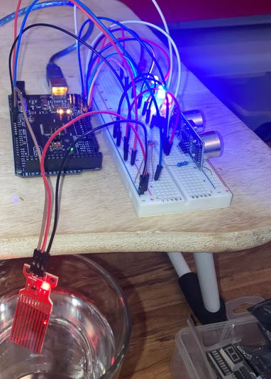
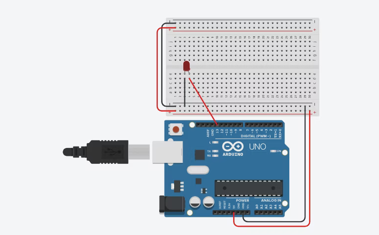
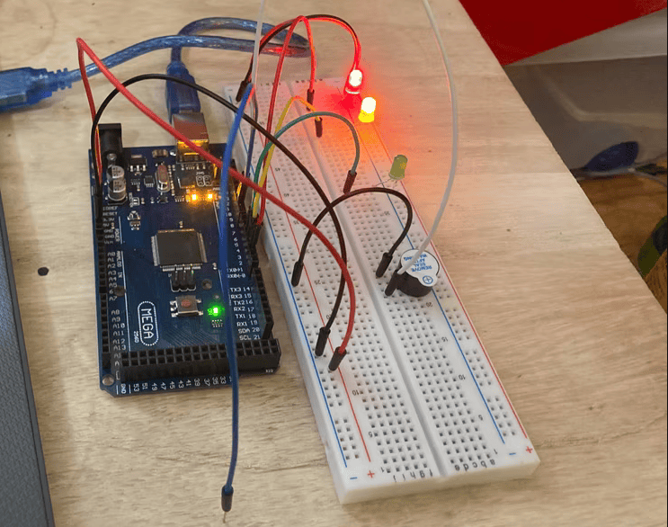
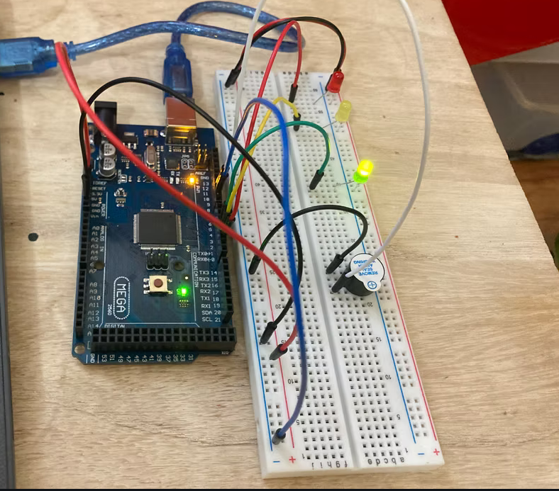
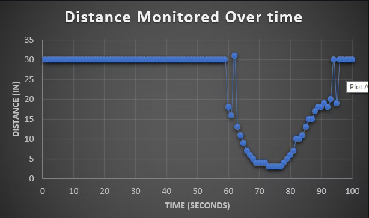
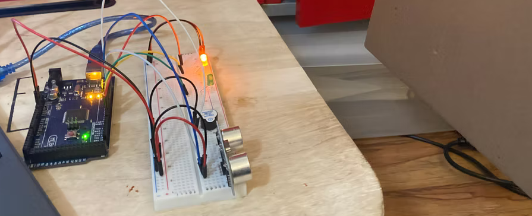
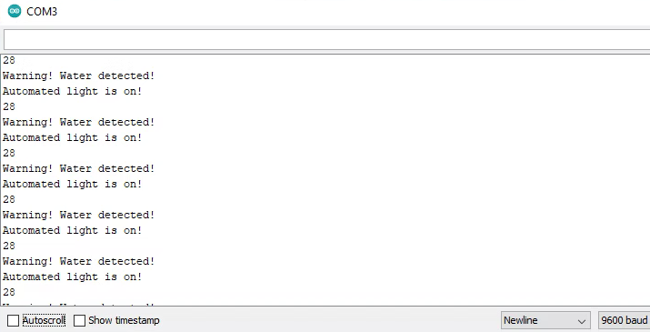

# IoT Home Security System Prototype

Arduino-based prototype security system combining intrusion detection and environmental monitoring. Built in C++ using multiple sensor types to simulate a deployable home security system with real-time alerts.

## Overview

The goal was to prototype a security system capable of detecting intrusion via proximity sensing, monitoring environmental conditions (temperature, humidity, flood risk, and ambient light), and triggering visual and audio alerts accordingly.

---

## Features

- **Intrusion detection** — ultrasonic sensor monitors door proximity; triggers red LED + buzzer when distance threshold is crossed
- **Flood detection** — water level sensor triggers red LED alert and Serial Monitor warning on high water
- **Automated lighting** — light sensor detects low-light conditions and activates blue LED
- **Environmental monitoring** — DHT sensor tracks temperature and humidity via Serial Monitor; designed to control AC in a deployed system

---

## Hardware

| Component | Purpose |
|---|---|
| Arduino Mega | Microcontroller |
| Ultrasonic sensor (HC-SR04) | Door/intrusion proximity detection |
| DHT11 sensor | Temperature + humidity monitoring |
| Photoresistor (LDR) | Ambient light detection |
| Water level sensor | Flood detection |
| LEDs (red, yellow, blue) | Visual status indicators |
| Buzzer | Audio alert on intrusion |
| Breadboard | Prototyping base |

---

## Circuit Diagram

---

## Door Detection

The ultrasonic sensor monitors distance continuously. When an object crosses the threshold (< 15 inches), the red LED and buzzer activate.

| State | Indicator |
|---|---|
| Area clear | Yellow LED |
| Intrusion detected | Red LED + buzzer |

### Distance Monitored Over Time

Recorded session showing baseline (~30in), a simulated intrusion event (near 0in), and return to baseline.

---

## Environmental Monitoring

Water detection and automated lighting run concurrently with intrusion detection. All alerts print to Serial Monitor in real time.

### Serial Monitor Output

---

## Pin Assignments

These are the default values defined in `home_security_system.ino`. If your wiring differs, update the `#define` constants at the top of the file — no other changes needed.

| Pin | Component |
|---|---|
| 9 | Ultrasonic TRIG |
| 10 | Ultrasonic ECHO |
| 7 | DHT11 data |
| A0 | Light sensor |
| A1 | Water level sensor |
| 2 | Red LED |
| 3 | Yellow LED |
| 4 | Blue LED |
| 5 | Buzzer |

---

## Usage

1. Wire components per the circuit diagram and pin table above
2. Install the [DHT sensor library](https://github.com/adafruit/DHT-sensor-library) in Arduino IDE
3. Open `home_security_system.ino` in Arduino IDE
4. Upload to your Arduino board
5. Open Serial Monitor at **9600 baud** to view live temperature, humidity, water, and light status

---

## What This Demonstrates

- Multi-sensor integration on a single microcontroller
- Real-time environmental monitoring with C++
- Hardware prototyping and breadboard circuit design
- Alert system with distinct visual + audio outputs per sensor condition
- Data visualization of sensor readings over time
